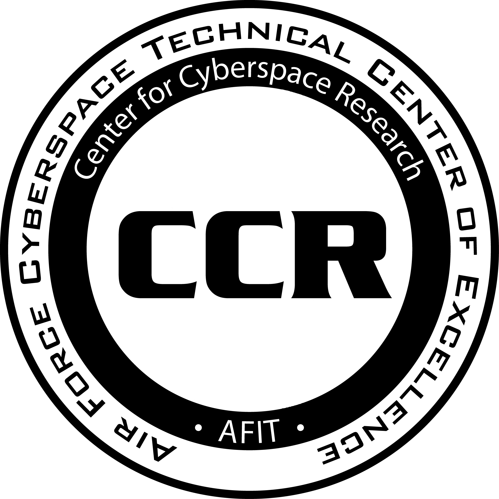

<div>
  
</div><br clear="all" /><br>


# Firmware Analysis Lab

Read through the entire lab before getting started, so you know what's coming.

In this lab, you will be performing static analysis on firmware samples from two different commercial devices. The first is a Rockwell 1756-L61 programmable logic controller (PLC), and the second is a SEL-3505-5 real-time automation controller (RTAC). Both are professional-grade devices used in industrial control systems (ICS).

Your goal is to analyze the firmware samples and answer a series of questions. There are multiple ways to derive the required information. You will need to explain how you discovered the information. 

As always, if you get stuck or want to verify your answer, ask for help.


# Setup

First, you will need to clone this repo in your Linux VM and extract the firmware files.

```bash
git clone https://github.com/sdunlap-afit/icefw.git
cd icefw
tar -xzf firmware_lab_files.tar.gz
```


## Tools

Install tools as needed. You can use the following commands to install the tools you need in WSL. Many of the tools are already installed in most Linux distributions.

```bash
sudo apt update             # If you just installed WSL, you have to run this first
sudo apt install vbindiff   # Visual binary diff tool
sudo apt install ghidra     # Reverse engineering tool
```

You will also need to write a Python script to decrypt the SEL firmware. There are some issues with pip and pycrypto, but the following library worked on my system

```bash
pip install pycryptodome
```


## strings

The `strings` command is a simple tool that extracts printable strings from a binary file. It's a good first step to see if there's anything interesting in the firmware.

```bash
strings filename.bin | less  # Pipe the output to less to make it easier to read
```

Things to look for:
* File paths
* Error messages
* Function names
* Copyright notices
* Compiler information
* Debugging information
* Configuration settings
* Encryption keys
* URLs
* Email addresses
* Anything else that looks interesting

## grep

`grep` is a powerful tool for regex searching. You can use it to search for specific strings or patterns in binary and text files. Once of my favorite ways to use it is to pipe the output of the `strings` command to `grep`. My other favorite way is to recursively search all files in a directory.

```bash
strings filename.bin | grep -i "password"  # -i makes the search case-insensitive
grep -Ri "password" .  # Recursively search all files in the current directory
```

## Hexdump

There are a few different hexdump tools available. My go-to is `hd`. If your system doesn't have it, you can use `hexdump -C` instead. If you prefer to use a visual hex editor, you can use `bless`. On Windows, you can use HxD. The visual hex editors are useful if you want to make changes to the file, but for this lab, you only need to view the contents.

```bash
hd filename.bin | less          # Pipe the output to less to make it easier to read
hexdump -C filename.bin | less  # Alternative form
```

Things to look for:
* Headers/footers
* Patterns
* Opcodes
* Endianness
* String tables


## vbindiff

`vbindiff` is a visual binary diff tool. It's useful for comparing two binary files to see what's different. If you compare major versions of the same firmware, you can spot the common elements. If you compare minor versions, you can spot things that always change.

```bash
vbindiff filename1.bin filename2.bin
```

`vbindiff` uses the keyboard to navigate the file. Pay attention to the menu at the bottom. I mainly use Page Up, Page Down, and Enter.

NOTE: If you're using a terminal in VSCode, bytes that are the same will be white, and bytes that are different will be **bold** white. This is hard to see. If you use a straight Ubuntu terminal, the changes will be red.

Things to look for:
* Headers/footers
* Length fields
* Version numbers
* Checksums/CRCs
* Common fields


## binwalk

Binwalk is a tool for searching a given binary file for signatures of **known** file types and blobs of data. There are tons of features, so it's worth reading the `man` page. Here are some examples to get you started.

```bash
binwalk filename.bin            # Analyze the file and list any identified signatures
binwalk -E filename.bin         # Graph the entropy of the file
binwalk --save -E filename.bin  # Save the entropy graph to a file
binwalk -e filename.bin         # Extract the contents of the file to _filename.bin.extracted/
binwalk -Me filename.bin        # Extract the contents of the file recursively
binwalk -A filename.bin         # Search for processor opcodes
```

Things to look for:
* Known file types
* Compression signatures
* Encryption signatures
* File systems
* Entropy
* Copyright notices
* OS signatures
* Many more


## binvis

Not needed for this lab, but a very cool tool for visualizing the contents of a binary file. You can use it to see patterns in the file that might not be obvious from a hexdump.

https://binvis.io/


