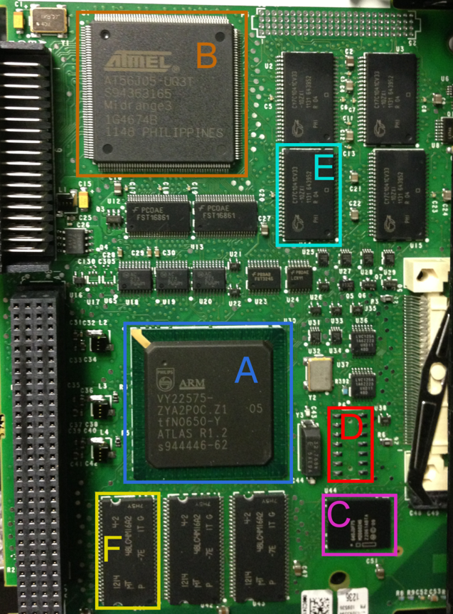

<div>
  
</div><br clear="all" /><br>


# Firmware Analysis Lab

Read through the entire lab before getting started, so you know what's coming.

In this lab, you will be performing static analysis on firmware samples from two different commercial devices. The first is a Rockwell 1756-L61 programmable logic controller (PLC), and the second is a SEL-3505-5 real-time automation controller (RTAC). Both are professional-grade devices used in industrial control systems (ICS).

Your goal is to analyze the firmware samples and answer a series of questions. There are multiple ways to derive the required information. You will need to explain how you discovered the information. 

As always, if you get stuck or want to verify your answer, ask for help.


## Turn-in:

Your turn-in for this lab will be a Teams quiz with the following:


1. 1756-L61 - Is the majority of the firmware encrypted, compressed, or neither? How do you know?

1. 1756-L61 - Is there a file system in the firmware? How do you know?

1. 1756-L61 - What processor architecture is the firmware for? How do you know?

1. 1756-L61 - What high-level language (i.e., NOT assembly) was used to write all/most of the firmware source code? How do you know?

1. 1756-L61 -  Where are the checksum and crc stored in the firmware? How do you know?


Note: The following SEL questions are intended to guide you through the process of decrypting the firmware. You will need to finish writing `upg_decrypt.py`, and answering these questions will help you find the information you need.

6. SEL-3505-5 - Based on `upgd_extract_upg_package`, what encryption algorithm is used to encrypt/decrypt the firmware? How do you know?

1. SEL-3505-5 - Based on the JTAG dump, what **key** is most likely used to **validate the source** of the firmware? How do you know?

1. SEL-3505-5 - Do engineers tend to group related things together?
    * Yes
    * No

1. SEL-3505-5 - Use Python to decrypt the firmware. What is the underlying file type of `rtac.upg` **after** decrypting it? How do you know?

1. SEL-3505-5 - List the three directories at the root of the decrypted and extracted image.


1. Survey - Roughly how long did you take to complete this lab?
1. Survey - What issues did you encounter during this lab?
1. Survey - What recommendations do you have for improving this lab for next year?


# Setup

First, you will need to download the firmware samples from the **Teams files** section. Unzip them and open a WSL terminal in the directory where you unzipped the files. You only need tools in WSL for this lab, but you're welcome to use any tools you like.


# Rockwell Automation 1756-L61

The 1756-L61 is a CPU module for the ControlLogix series of PLCs. It is used in a wide variety of industrial control systems. The firmware is stored in a flash chip and is updated over the network. I have provided three different versions of the firmware for the 1756-L61. These were simply downloaded from Rockwell's website. You will need to analyze them and answer the questions above.

* PN-49503.bin - version 16.56
* PN-49505.bin - version 16.80
* PN-69415.bin - version 18.11

<div align="center">

</div><br/>

# Schweitzer Engineering Laboratories (SEL) SEL-3505-5

The SEL-3505-5 is a real-time automation controller (RTAC) used in a wide variety of industrial control systems. These RTACs are ubiquitous in the power industry. The firmware is not available for download, but I emailed customer support from my AFIT email and asked politely for some firmware versions. They were happy to oblige and sent me three different versions, although you only need one for this lab. 

This RTAC is a text-book example of security for embedded system firmware. They did pretty much everything correctly (at least with their firmware). In order to break their security, I am providing additional data obtained via JTAG.

* rtac.upg - Raw firmware update file as received from SEL
* 0xfff00000_0xffffffff.bin - This is a raw memory dump from the device, obtained via JTAG
* upgd_extract_upg_package - This executable was extracted from a device using JTAG
* upg_decrypt.py - Starting point for you to write a Python script to decrypt the firmware

<div align="center">

</div><br/>

# Tools

## Install

Install tools as needed. You can use the following commands to install the tools you need in WSL. Many of the tools you need are already installed in most Linux distributions.

```bash
sudo apt update             # If you just installed WSL, you have to run this first
sudo apt install binwalk    # Binary analysis tool
sudo apt install vbindiff   # Visual binary diff tool
sudo apt install bless      # Visual hex editor (although I prefer hd)
```

You will also need to write a Python script to decrypt the SEL firmware. There are some issues with pip and pycrypto, but the following library worked on my system

```bash
sudo apt install python3 python3-pip
pip install pycryptodome
```


## strings

The `strings` command is a simple tool that extracts printable strings from a binary file. It's a good first step to see if there's anything interesting in the firmware.

```bash
strings filename.bin | less  # Pipe the output to less to make it easier to read
```

Things to look for:
* File paths
* Error messages
* Function names
* Copyright notices
* Compiler information
* Debugging information
* Configuration settings
* Encryption keys
* URLs
* Email addresses
* Anything else that looks interesting

## grep

`grep` is a powerful tool for regex searching. You can use it to search for specific strings or patterns in binary and text files. Once of my favorite ways to use it is to pipe the output of the `strings` command to `grep`. My other favorite way is to recursively search all files in a directory.

```bash
strings filename.bin | grep -i "password"  # -i makes the search case-insensitive
grep -Ri "password" .  # Recursively search all files in the current directory
```

## Hexdump

There are a few different hexdump tools available. My go-to is `hd`. If your system doesn't have it, you can use `hexdump -C` instead. If you prefer to use a visual hex editor, you can use `bless`. On Windows, you can use HxD. The visual hex editors are useful if you want to make changes to the file, but for this lab, you only need to view the contents.

```bash
hd filename.bin | less          # Pipe the output to less to make it easier to read
hexdump -C filename.bin | less  # Alternative form
```

Things to look for:
* Headers/footers
* Patterns
* Opcodes
* Endianness
* String tables


## vbindiff

`vbindiff` is a visual binary diff tool. It's useful for comparing two binary files to see what's different. If you compare major versions of the same firmware, you can spot the common elements. If you compare minor versions, you can spot things that always change.

```bash
vbindiff filename1.bin filename2.bin
```

`vbindiff` uses the keyboard to navigate the file. Pay attention to the menu at the bottom. I mainly use Page Up, Page Down, and Enter.

NOTE: If you're using a terminal in VSCode, bytes that are the same will be white, and bytes that are different will be **bold** white. This is hard to see. If you use a straight Ubuntu terminal, the changes will be red.

Things to look for:
* Headers/footers
* Length fields
* Version numbers
* Checksums/CRCs
* Common fields


## binwalk

Binwalk is a tool for searching a given binary file for signatures of **known** file types and blobs of data. There are tons of features, so it's worth reading the `man` page. Here are some examples to get you started.

```bash
binwalk filename.bin            # Analyze the file and list any identified signatures
binwalk -E filename.bin         # Graph the entropy of the file
binwalk --save -E filename.bin  # Save the entropy graph to a file
binwalk -e filename.bin         # Extract the contents of the file to _filename.bin.extracted/
binwalk -Me filename.bin        # Extract the contents of the file recursively
binwalk -A filename.bin         # Search for processor opcodes
```

Things to look for:
* Known file types
* Compression signatures
* Encryption signatures
* File systems
* Entropy
* Copyright notices
* OS signatures
* Many more


## binvis

Not needed for this lab, but a very cool tool for visualizing the contents of a binary file. You can use it to see patterns in the file that might not be obvious from a hexdump.

https://binvis.io/


# Encryption Refresher

There are two main types of encryption: symmetric and asymmetric. 

Symmetric encryption uses the same key for both encryption and decryption. This form of encryption is much faster than asymmetric encryption and is used for encrypting/decrypting bulk data.

Asymmetric encryption uses a public key for one direction and a private key for the other. The public key can be shared with anyone; the private key must be kept secret. This form of encryption is used to validate the source and integrity of the data (i.e., digital signatures). It can also be used for authentication.


