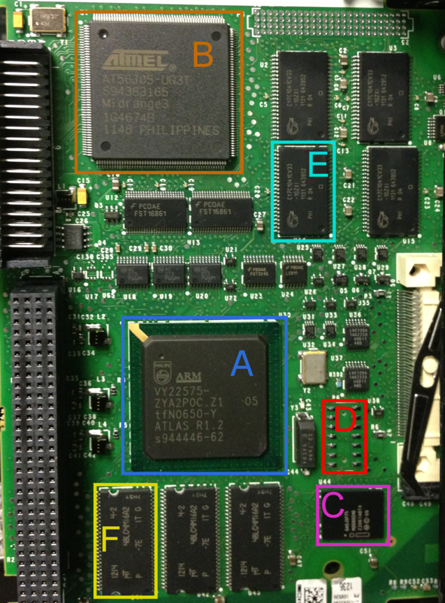

# Rockwell Automation 1756-L61

The 1756-L61 is a CPU module for the ControlLogix series of PLCs. It is used in a wide variety of industrial control systems. The firmware is stored in a flash chip and is updated over the network. I have provided three different versions of the firmware for the 1756-L61. These were simply downloaded from Rockwell's website. You will need to analyze them and answer some questions.

* PN-49503.bin - version 16.56
* PN-49505.bin - version 16.80
* PN-69415.bin - version 18.11

<div align="center">

</div><br/>


# Questions

1. Is the majority of the firmware encrypted, compressed, or neither?
1. What processor architecture is the firmware compiled for?
1. What high-level language (i.e., NOT assembly) was used to write all/most of the firmware source code?
1. Is there a file system in the firmware?
1. Where are the checksum and CRC stored in the firmware?


# Instructions

Open a terminal and navigate to the directory with the firmware files.

```bash
cd firmware_lab_files
```

You can also open this directory in Visual Studio Code. We'll use a raw terminal for some commands and the VSCode terminal for others.


## Is the majority of the firmware encrypted, compressed, or neither?

Before we can start answering other questions, we need to determine if the firmware is encrypted or compressed. If it is, we won't be able to see much with our basic tools.

There are many ways to check for this. One way is to use the `strings` command to look for human-readable strings in the firmware. If you see a lot of garbage characters, the firmware is likely compressed or encrypted. If you see a lot of human-readable strings, it's probably not compressed or encrypted.

```bash
strings PN-49503.bin | less
```

You can also use the `binwalk` tool to look for common compression and encryption signatures.

```bash
binwalk PN-49503.bin
```

You can also check the entropy of the firmware to see if it is compressed or encrypted. Compressed or encrypted content will have very high entropy (basically a flat line on the graph).

```bash
binwalk -E PN-49503.bin
```

Lastly, you can use `hd` to skim through the bytes and see if you spot any patterns. If you see patterns, it's not compressed or encrypted.

```bash
hd PN-49503.bin | less
```


## What processor architecture is the firmware compiled for?

You can use the `strings` command to look for compiler information in the firmware. Look for strings that indicate the compiler or the processor architecture.

```bash
strings PN-49503.bin | less
```

Even easier, you can also use `binwalk` to look for common processor architectures. This won't work for all architectures, but it will work for the most common ones.

```bash
binwalk -A PN-49503.bin
```


## What high-level language (i.e., NOT assembly) was used to write all/most of the firmware source code?

Strings can provide numerous clues from the developers. Even without a filesystem, there may still be debug strings and other artifacts left over from the developer machines. Sometimes, you can even find developer names and email addresses in the strings. It is also common to find compiler information and copyright notices, which can help you identify the high-level languages and libraries used to write the firmware.

```bash
strings PN-49503.bin | less
```


## Is there a file system in the firmware?

You can use `binwalk` to look for common file system signatures. Be wary of false positives. Also, you **can** have individual files in a binary without a file system.

```bash
binwalk PN-49503.bin
```


## Where are the checksum and CRC stored in the firmware?

This is a tough one. There's no automatic way to find checksums and CRCs. You'll have to look for them manually. They are often stored in the firmware as a separate section or as part of the header or footer. You can disassemble parts of the firmware and analyze the code, but you're looking for a needle in a haystack. You can use a tool to brute force it, but any non-standard algorithms will be missed. Sometimes, you get lucky.

In this case, we can compare different versions of the firmware to deduce some information.

```bash
# Compare major versions to find similarities
vbindiff PN-49503.bin PN-69415.bin

# Compare minor versions to find differences
vbindiff PN-49503.bin PN-49505.bin
```

