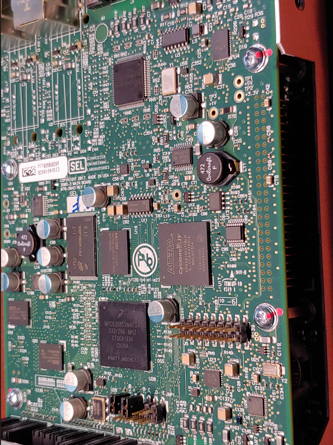
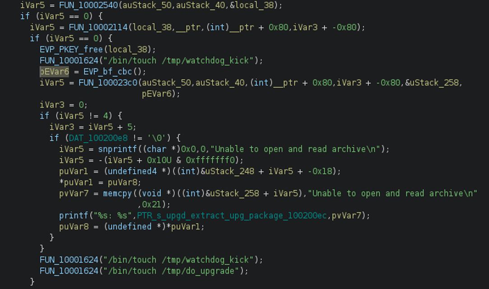

# Schweitzer Engineering Laboratories (SEL) SEL-3505-5

The SEL-3505-5 is a real-time automation controller (RTAC) used in a wide variety of industrial control systems. These RTACs are ubiquitous in the power industry. The firmware is not available for download, but I emailed customer support from my AFIT email and asked politely for some firmware versions. They were happy to oblige and sent me three different versions, although you only need one for this lab. 

This RTAC is a text-book example of security for embedded system firmware. They did pretty much everything correctly (at least with their firmware). In order to break their security, I am providing additional data obtained via JTAG.

* rtac.upg - Raw firmware update file as received from SEL
* 0xfff00000_0xffffffff.bin - This is a raw memory dump from the device, obtained via JTAG
* upgd_extract_upg_package - This executable was extracted from a device using JTAG
* upg_decrypt.py - Starting point for you to write a Python script to decrypt the firmware

 

# Encryption Refresher

There are two main types of encryption: symmetric and asymmetric. 

Symmetric encryption uses the same key for both encryption and decryption. This form of encryption is much faster than asymmetric encryption and is used for encrypting/decrypting bulk data.

Asymmetric encryption uses a public key for one direction and a private key for the other. The public key can be shared with anyone; the private key must be kept secret. This form of encryption is used to validate the source and integrity of the data (i.e., digital signatures). It can also be used for authentication.

# Reverse Engineering ELF file

Using JTAG, we managed to extract an ELF executable responsible for conducting firmware updates. We now need to reverse-engineer this ELF file to determine how the firmware is encrypted. For this, we'll use Ghidra, a free reverse engineering tool developed by the NSA.

## Instructions

1. Open Ghidra and create a new project.
1. Import `upgd_extract_upg_package` file into the project and under `Language`, select `PowerPC` variant `default`.
1. Open CodeBrowser. In CodeBrowser, select `File/Open...` and select `upgd_extract_upg_package`.
1. Select `Yes` and then `Analyze` to analyze the file.
1. Select `Window/Functions` to open the functions panel and then sort by name.
1. Look for functions starting with `EVP_`. These are likely encryption functions.
1. Select `EVP_bf_cbc` (there are two) and look for an XREF starting with `FUN_`. Double-click the XREF to jump to the call.
1. Open the decompile window and analyze the function.

    

    
    
 

1. Open the function immediately following `EVP_bf_cbc` and use the function calls to guess what it's doing. 
1. Go back to the call immediately following `EVP_bf_cbc` and analyze the function parameters in the decompile window. This gives us a critical clue about the firmware format.
1. There is a function call with similar parameters a few lines before the call to `EVP_bf_cbc`. Open this function and analyze it.

